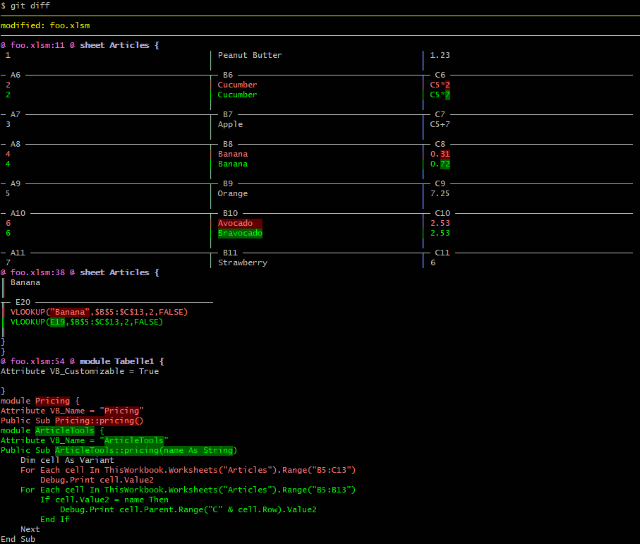

XLSMToText converter
====================

A small Java based utility to turn XLSX and XLSM files into text files suitable
for diffing.

For cells only formulas / values are exported. Styling and other meta
information is ignored. For XLSM files the VBA projects module code is exported
as well.

How to use in Git
-----------------

First add four keys to your Git config:

    git config --global diff.xlsm.textconv "java -Dfile.encoding=UTF-8 -Dline.separator=$'\n' -jar C:/path/to/XLSMToText-1.0.jar"
    git config --global diff.xlsm.cachetextconv true
    git config --global diff.xlsm.binary true
    git config --global diff.xlsm.xfuncname "^((sheet|module) .* \\{|(Private|Public|) (Function|Sub) [^(]+\\([^)]*\\).*)$"

Then add the following line to your repos `.gitattributes`:

    *.xls[xm] diff=xlsm

Optionally have a look at [diff-so-fancy](https://github.com/so-fancy/diff-so-fancy).

Building
--------

    mvn package

License terms
-------------

This software is distributed under the Apache License version 2. The full text
of the license can be found at [https://www.apache.org/licenses/LICENSE-2.0.txt](https://www.apache.org/licenses/LICENSE-2.0.txt).

This script was modified from [the POI XLSX2CSV.java example script](https://svn.apache.org/repos/asf/poi/trunk/poi-examples/src/main/java/org/apache/poi/examples/xssf/eventusermodel/XLSX2CSV.java).
That script is licenced under the Apache license version 2.